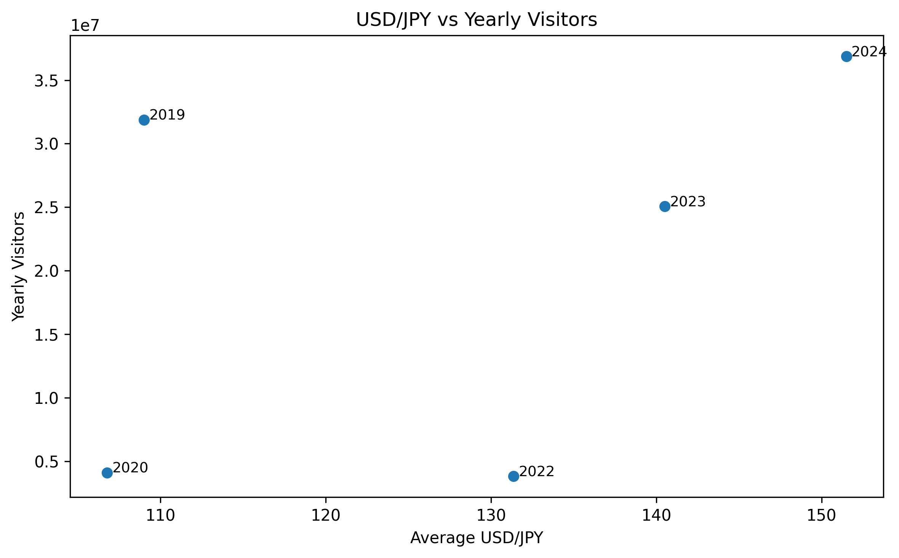
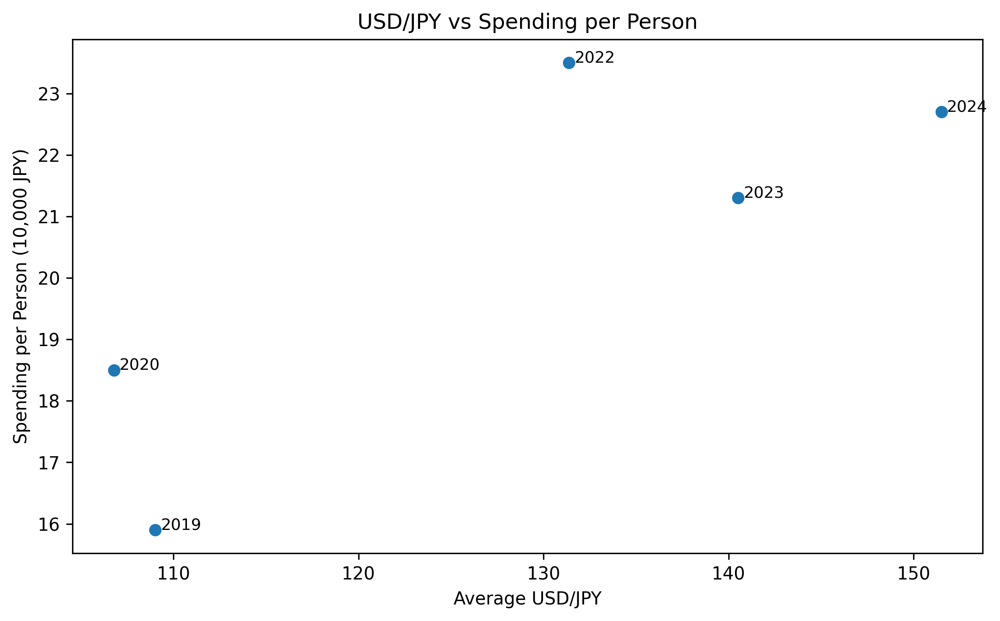

# SQL Analysis of Inbound Tourism in Japan

This project analyzes inbound tourism trends in Japan using SQL and Python.

## Overview
The analysis combines:
- yearly inbound visitors
- average USD/JPY exchange rate
- average REER
- tourism spending
- spending per person

Monthly tourism and exchange-rate data were aggregated into yearly data using SQL, and then merged with yearly tourism spending data.

## Tools
- Python
- pandas
- DuckDB
- matplotlib

## Analysis Flow
1. Load monthly exchange rate data and monthly inbound visitor data
2. Clean and rename columns
3. Aggregate monthly data into yearly data using SQL
4. Merge yearly tourism spending data
5. Visualize the relationship between exchange rates, visitors, and spending

## Key Outputs
- USD/JPY vs Yearly Visitors

- USD/JPY vs Spending per Person

## Main Finding
The relationship between exchange rates and inbound visitors appears positive, but the relationship between exchange rates and spending per person appears stronger.
